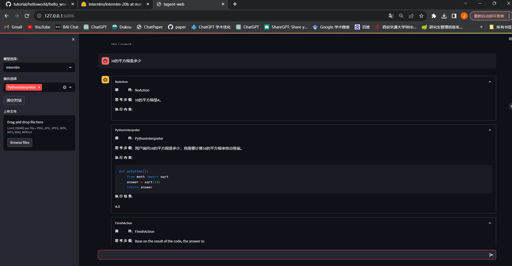

### 基础作业
##### 使用 InternLM-Chat-7B 模型生成 300 字的小故事（需截图）

首先激活环境，在vscode的服务器终端里运行web_demo.py文件，端口6006
然后在本地输入ssh -CNg -L 6006:127.0.0.1:6006 root@ssh.intern-ai.org.cn -p 33872映射

浏览器输入http://127.0.0.1:6006
就可以打开

模型加载等待几分钟

当服务器端加载完毕后就可以打开
生成一个小故事：

##### 熟悉 hugging face 下载功能，使用 huggingface_hub python 包，下载 InternLM-20B 的 config.json 文件到本地（需截图下载过程）
安装依赖

出现网络错误：
requests.exceptions.ProxyError: (MaxRetryError("HTTPSConnectionPool(host='huggingface.co', port=443): Max retries exceeded with url: /internlm/internlm-20b/resolve/main/config.json (Caused by ProxyError('Cannot connect to proxy.', TimeoutError('timed out')))"), '(Request ID: eb98c0d6-dcc2-41fb-9a3c-6fd472c72d7b)')
加入代理再次下载：

下载成功

### 进阶作业（可选做）

##### 完成浦语·灵笔的图文理解及创作部署（需截图）
服务器：
cd /root/code/InternLM-XComposer
python examples/web_demo.py  \
    --folder /root/model/Shanghai_AI_Laboratory/internlm-xcomposer-7b \
    --num_gpus 1 \
    --port 6006

本地：
ssh -CNg -L 6006:127.0.0.1:6006 root@ssh.intern-ai.org.cn -p 33879
端口号修改，其他的不用变。
创作图文并茂文章：

多模态对话：

##### 完成 Lagent 工具调用 Demo 创作部署（需截图）
类似1的方式，进行端口映射，打开界面

数学运算:

稍微复杂一点的题目：给出的解答是正确的，但是不是完整的解答
